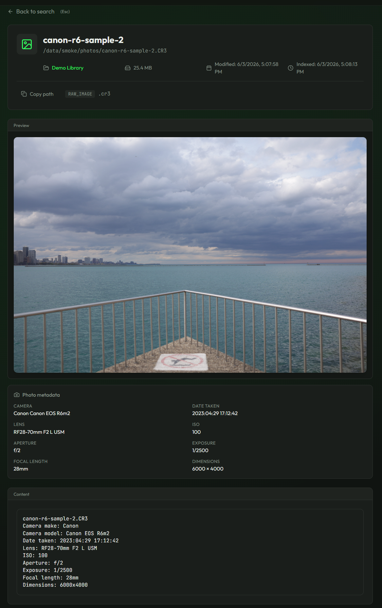

# OneSearch

<p align="center">
  
</p>

<p align="center">
  Logo by <a href="https://www.briefreelancing.com/">Briefreelancing</a>.
</p>

[](https://www.gnu.org/licenses/agpl-3.0)
[](https://github.com/demigodmode/OneSearch/releases/latest)
[](https://github.com/demigodmode/OneSearch/actions/workflows/backend-tests.yml)
[](https://hub.docker.com/r/demigodmode/onesearch)
[](https://onesearch.readthedocs.io)

Search your homelab like you search the web.

OneSearch indexes your local directories, NAS shares, and external drives and gives you instant full-text search from a browser. No cloud, no telemetry, runs in Docker.


---

## Quick Start

```bash
mkdir onesearch && cd onesearch
curl -O https://raw.githubusercontent.com/demigodmode/OneSearch/main/docker-compose.yml
curl -O https://raw.githubusercontent.com/demigodmode/OneSearch/main/.env.example
cp .env.example .env
```

Edit `.env` and set `MEILI_MASTER_KEY` to a random string (`openssl rand -base64 32` works).

```bash
docker-compose up -d
```

Open http://localhost:8000, run through the setup wizard, add a directory as a source, and start searching.

> **Existing installs:** the default Docker setup now runs OneSearch and managed Meilisearch in a single container. Existing two-container installs do not need to switch immediately. If you do switch, keep your `/app/data` volume and run a full reindex after moving to managed mode. The old two-container external Meilisearch setup is still supported in `docker-compose.legacy.yml`.

Full setup guide: [onesearch.readthedocs.io](https://onesearch.readthedocs.io/en/latest/getting-started/installation/)

---

## What it indexes

| Type | Formats |
|------|---------|
| Documents | PDF, Word (.docx), Excel (.xlsx), PowerPoint (.pptx), RTF |
| Ebooks & comics | EPUB, CBZ comic archives |
| Images & RAW photos | JPG, PNG, WebP, GIF, TIFF, CR2, CR3, NEF, ARW, RAF, ORF, RW2, DNG |
| Media metadata | MP4, MKV, MOV, AVI, MP3, FLAC, M4A, OGG, WAV |
| Subtitles | SRT, WebVTT, ASS/SSA |
| Markdown | .md, .markdown |
| Code | .py, .js, .ts, .go, .rs, .java, .c, .cpp, .sh, .sql, [and more](https://onesearch.readthedocs.io/en/latest/supported-formats/text-files/) |
| Config | .yaml, .toml, .json, .xml, .ini, .env, [and more](https://onesearch.readthedocs.io/en/latest/supported-formats/text-files/) |
| Text | .txt, .log |

Incremental indexing so only changed files get reindexed. Per-source cron schedules so your NAS gets scanned daily without thinking about it.

---

## Screenshots

Search across mounted folders and mixed file types:


Preview extracted text with highlighted matches:


Search image and RAW photo metadata:



Track source health and indexing status:


---

## Documentation

**[onesearch.readthedocs.io](https://onesearch.readthedocs.io)**

- [Installation Guide](https://onesearch.readthedocs.io/en/latest/getting-started/installation/)
- [User Guide](https://onesearch.readthedocs.io/en/latest/user-guide/)
- [CLI Reference](https://onesearch.readthedocs.io/en/latest/cli/) - standalone `onesearch-cli` package that connects to your running OneSearch server and ships from the same tagged release as the Docker image
- [API Reference](https://onesearch.readthedocs.io/en/latest/api/)

---

## Development

```bash
git clone https://github.com/demigodmode/OneSearch.git
cd OneSearch
```

See the [Development Guide](https://onesearch.readthedocs.io/en/latest/development/) for setup instructions.

---

## License

[AGPL-3.0](LICENSE). Free to use, modify, and distribute. If you deploy a modified version as a network service, source must be made available.

---

## Support

- [GitHub Issues](https://github.com/demigodmode/OneSearch/issues) - bugs and feature requests
- [GitHub Discussions](https://github.com/demigodmode/OneSearch/discussions) - questions and ideas
- [Documentation](https://onesearch.readthedocs.io) - guides and reference
